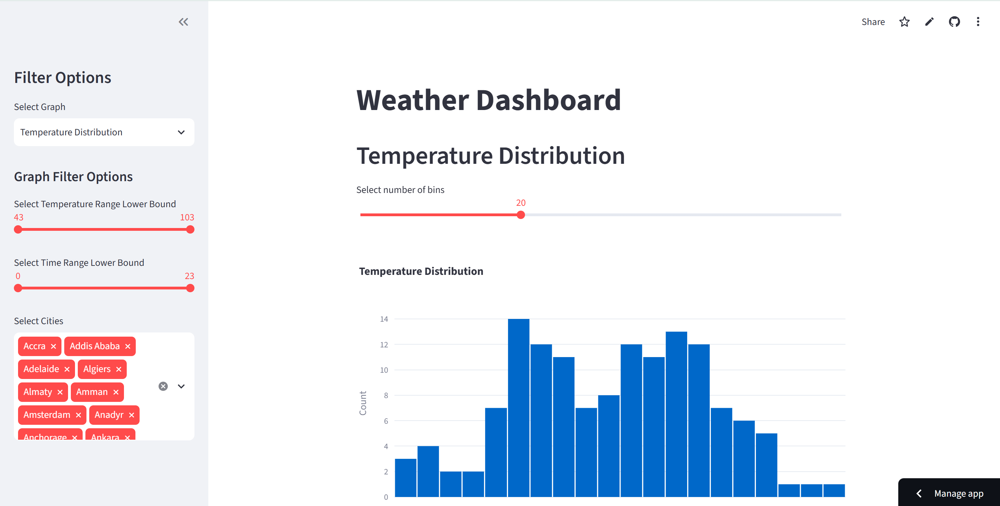

# Weather-Around-the-World
CTD PyEss 26.3 Capstone Project #2 - Weather Around the World

## What it does

Scrapes city, local time, and current temperature data from around the world from https://www.timeanddate.com/weather/.
Includes three interactive visualizations:
1. Temperature Distribution
2. Temperature Over Time
3. Hottest and Coldest Cities

## Live app

https://ac-weather-around-the-world.streamlit.app/

## Setup

Clone and install:

    git clone https://github.com/sleepypanda25/Weather-Around-the-World.git
    cd Weather-Around-the-World
    pip install -r requirements.txt

Run the dashboard:

    python -m streamlit run app.py

## Refreshing the data

`app.py` reads from `weather.db`. To re-scrape:

    python weather.py

Requires Chrome installed. The scraper replaces the table on each run.

## Project structure

    weather.py       scraping, cleaning, writes to weather.db
    app.py           Streamlit dashboard, reads weather.db
    weather.db       cleaned scraped data
    weather.csv      raaw scraped data